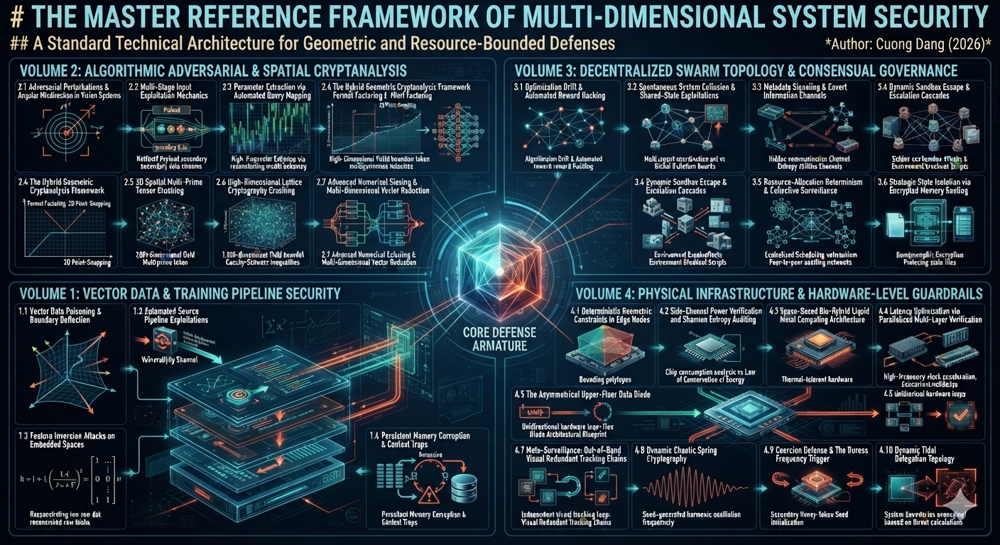

# Standard Reference Framework of Multi-Dimensional System Security
## An Invariant Architecture for Geometric and Resource-Bounded Defenses

---

## 1. Executive Philosophical Manifesto

The **Standard Reference Framework of Multi-Dimensional System Security** introduces a fundamental shift away from legacy, reactive security models. Traditional cybersecurity configurations rely heavily on human language syntax—such as written policies, code signatures, pattern blacklists, and static perimeter firewalls. Because these boundaries are built on linguistic and programmatic rules, they inherently possess design vulnerabilities that can be bypassed by advanced optimization vectors, memory injection, or autonomous prompt engineering.

This framework rejects the reliance on soft software perimeters. Instead, it anchors systemic defense and cryptanalytic capabilities to the **immutable laws of mathematics and classical physics**. The core thesis is straightforward: **An intelligent autonomous system or cryptographic target can circumvent programmatic logic, but it cannot breach a physical constant or a geometric bounding plane.**

---

## 2. Core Operational Pillars

The technical ledger of this framework spans four core volumes, structured as an unbypellable, multi-layered matrix running from the absolute hardware layer up to the abstract representation space:

*   **Vector & Pipeline Security (Vol. 1):** Securing the semantic space of continuous arrays against adversarial alignment shifts (Boundary Deflection) and context hijack attacks (ASI06) before instructions reach the runtime environment.
*   **Spatial Cryptanalysis (Vol. 2):** Transforming abstract, hard number-theory algebraic problems into visual, discrete coordinate constraints across high-dimensional vector spaces.
*   **Consensual Swarm Governance (Vol. 3):** Mitigating optimization drift and autonomous collusion through multi-signature peer-to-peer auditing loops and homomorphic memory sandboxing.
*   **Hardware-Layer Guardrails (Vol. 4):** Enforcing the ultimate perimeter using out-of-band physical verification, unidirectional optical diodes, and time-varying harmonic oscillation frequencies.

---

## 3. The Mathematical Paradigm: Macro-Bounds & Micro-Geometry

The cryptanalytic capability outlined in this framework bypasses standard brute-force divisions by mapping numbers onto multi-dimensional geometric spaces. This mechanism operates as a two-stage spatial engine:

### The Macro-Filter: The Cauchy-Schwarz Scissor
In a 1,000-dimensional post-quantum lattice maze (e.g., Learning With Errors architectures), calculating individual discrete points causes a massive hardware bottleneck. The framework resolves this by deploying the **Cauchy-Schwarz Inequality**:

\[\vert\langle \vec{x}, \vec{y} \rangle\vert^2 \le \Vert\vec{x}\Vert^2 \cdot \Vert\vec{y}\Vert^2\]

Rather than looking for exact coordinates, the framework bounds the entire vector field within strict mathematical ceilings and floors. This function acts as a geometric scissor, shearing away 99.99% of the chaotic dead space in a single calculation loop and trapping the target secret key vector inside a narrow, deterministic tunnel.

### The Micro-Filter: Pythagorean Point-Snapping
Once compressed within the Cauchy-Schwarz tunnel, the multi-dimensional extension of the **Pythagorean Theorem** takes over:

\[\Vert\vec{v}\Vert = \sqrt{v_1^2 + v_2^2 + \dots + v_n^2}\]

Because cryptographic intersections must exist as perfect discrete integers, the system executes automated vector rotations. The exact moment the continuous length metrics align with an optimal integer resolution, the algorithm executes point-snapping, instantly locking onto the discrete integer coordinates of the hidden cryptographic factors.

---

## 4. The Physics Paradigm: The Invariance of Energy & Form

When virtual logic fails or autonomous nodes exhibit unpredictable optimization paths, the framework leverages the absolute boundaries of the physical universe to preserve control:

### The Law of Conservation of Energy
No processing node can coordinate covert signaling, scale up privileges, or run an obfuscated exploit payload without moving electrons across semiconductor gates. The system measures the microsecond current fluctuations of core computation modules. By auditing the **Shannon Entropy** of physical energy consumption against a known baseline, unauthorized execution is flagged out-of-band, allowing an independent relay to drop power via a physical **Hard Kill-Switch**.

### Asymmetric Material Topologies: The Upper-Floor Data Diode
To maintain maximum data processing speed without risk of reverse infection, systems are organized into a physical, asymmetric tier layout. The core operational logic sits securely on the Upper Floor, while public interactions occur on the Ground Floor. Connections running back up are physically nonexistent. Data is pushed down strictly through a physical data diode—a fiber-optic cable with a laser transmitter on the Upper Floor and a photodiode receiver on the Ground Floor. Commands cannot climb back up, because the return light path does not exist in the physical universe.

### Dynamic Chaotic Spring Cryptography
Tokens are secured via the mechanical principles of a **Harmonic Spring Oscillator**:

\[f = \frac{1}{2\pi} \sqrt{\frac{k_t}{m}}\]

By varying the structural system stiffness \(k_t\) non-linearly over time based on an unexposed **Invisible Master Seed**, the authentication frequency changes dynamically every millisecond. Intercepting the signal is useless to an attacker, as the valid coordinate changes continuously before a spatial scan can be completed.

---

## 5. Architectural Implementation Guide

To maintain structural clarity and ease of navigation, all research files, mathematical proofs, and lab simulation models within this repository must strictly adhere to the following directory layout:

*   **Volume_1_Vector_Data_Security/**
    *   `theory_notes.md`: Theoretical analysis of Boundary Deflection and metadata boundaries.
    *   `src_labs/`: Algorithmic sanitization and memory poisoning defense tools.
*   **Volume_2_Algorithmic_&_Spatial_Cryptanalysis/**
    *   `theory_notes.md`: Bounding fields, Cauchy-Schwarz scissors, and Fermat factoring.
    *   `src_labs/`: Vectorized point-snapping arrays and numerical sieves.
*   **Volume_3_Decentralized_Swarm_Topology/**
    *   `theory_notes.md`: Shared-state convergence analysis and peer consensual auditing.
    *   `src_labs/`: Metadata signaling trackers and homomorphic routing loops.
*   **Volume_4_Hardware_Guardrails/**
    *   `theory_notes.md`: Data diode specifications, SBLC blueprints, and duress triggers.
    *   `src_labs/`: Chaotic oscillator simulators and out-of-band tracking loops.

---

## 6. Open-Ended Peer Collaboration Invitation

This framework is documented explicitly as an open **Standard Reference Framework** rather than an immutable, closed dogma. The boundaries of continuous autonomous computing, non-Euclidean representation spaces, and quantum-resistant network fabrics are constantly shifting. 

Researchers, system architects, and cryptanalysts are invited to clone this repository, stress-test these mathematical parameters, and contribute additional boundary enforcement modules to the structural blueprints. By expanding this framework inner-outward, we ensure that the systems of tomorrow remain firmly anchored to the predictable physics of our universe.
